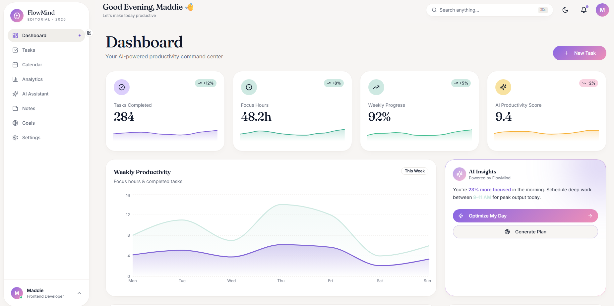

# 🧠 FlowMind AI — Productivity Dashboard

<div align="center">



[](https://react.dev/)
[](https://www.typescriptlang.org/)
[](https://tailwindcss.com/)
[](https://vitejs.dev/)
[](https://www.framer.com/motion/)
[](https://vercel.com/)

**A modern AI-powered productivity SaaS dashboard with premium editorial UI**

[🌐 Live Demo](https://flowmind-ai-qsv5.vercel.app/) · [🐙 GitHub](https://github.com/kuutam/flowmind-ai) · [💼 Portfolio](https://maddie-portfolio-brown.vercel.app/)

</div>

---

## 📸 Preview

> A full-featured productivity platform with task management, analytics, AI assistant, and intelligent workflows — all wrapped in a sleek dark UI.

---

## ✨ Features

- 📋 **Kanban Board** — Drag & drop task management with dnd-kit
- 📊 **Analytics Dashboard** — Interactive charts and productivity insights powered by Recharts
- 🤖 **AI Productivity Assistant** — Smart suggestions and intelligent workflow automation
- 🌙 **Dark / Light Mode** — Seamless theme switching
- 🎨 **Premium UI** — Editorial-style design with smooth Framer Motion animations
- 📱 **Fully Responsive** — Optimized for all screen sizes
- ⚡ **High Performance** — Built with Vite for lightning-fast dev and build times

---

## 🛠️ Tech Stack

| Category | Technology |
|----------|-----------|
| **UI Library** | React 19 |
| **Language** | TypeScript |
| **Build Tool** | Vite |
| **Styling** | Tailwind CSS + shadcn/ui |
| **Animations** | Framer Motion |
| **Charts** | Recharts |
| **Drag & Drop** | dnd-kit |
| **Linting** | ESLint |
| **Testing** | Vitest |
| **Deployment** | Vercel |

---

## 📁 Project Structure

```
flowmind-ai/
├── public/
│   └── assets/
├── src/
│   ├── components/
│   │   ├── ui/           # shadcn/ui base components
│   │   ├── dashboard/    # Dashboard widgets
│   │   ├── kanban/       # Kanban board components
│   │   ├── analytics/    # Charts and stats
│   │   └── ai/           # AI assistant components
│   ├── pages/
│   ├── hooks/
│   ├── lib/
│   └── main.tsx
├── index.html
├── vite.config.ts
├── tailwind.config.ts
└── README.md
```

---

## 🚀 Getting Started

### Prerequisites

Make sure you have installed:
- [Node.js](https://nodejs.org/) v18+
- [pnpm](https://pnpm.io/) (recommended) or npm

### Installation

```bash
# 1. Clone the repository
git clone https://github.com/kuutam/flowmind-ai.git

# 2. Navigate to the project directory
cd flowmind-ai

# 3. Install dependencies
pnpm install
# or
npm install

# 4. Start the development server
pnpm dev
# or
npm run dev
```

Open [http://localhost:5173](http://localhost:5173) in your browser.

---

## 📦 Available Scripts

```bash
pnpm dev        # Start development server (Vite)
pnpm build      # Build for production
pnpm preview    # Preview production build locally
pnpm lint       # Run ESLint
pnpm test       # Run tests with Vitest
```

---

## 🎨 Design Highlights

- **Editorial dark UI** with deep navy/dark backgrounds
- **Glassmorphism cards** with subtle borders and backdrop blur
- **Micro-interactions** on every interactive element
- **Smooth page transitions** powered by Framer Motion
- **Consistent design system** using shadcn/ui components
- **Data visualizations** with custom-styled Recharts

---

## 🚢 Deployment

This project is deployed on **Vercel** with automatic CI/CD.

```bash
# Install Vercel CLI
npm i -g vercel

# Deploy
vercel
```

Or push to `main` and Vercel will deploy automatically if your repo is connected.

---

## 🗺️ Roadmap

- [ ] Backend integration with REST API
- [ ] User authentication (Auth.js)
- [ ] Real-time collaboration features
- [ ] Mobile app (React Native)
- [ ] AI-powered task prioritization
- [ ] Calendar view integration

---

## 👩‍💻 Author

**Maddie** — Junior Full Stack Developer

- 🌐 Portfolio: [maddie-portfolio-brown.vercel.app](https://maddie-portfolio-brown.vercel.app/)
- 💼 LinkedIn: [Madeline Ascencio](https://linkedin.com/in/kuutam)
- 🐙 GitHub: [@kuutam_o](https://github.com/kuutam)
- 📺 YouTube: [@kaihackss](https://youtube.com/@kaihackss)
- 📧 Email: [contact_madd@pm.me](mailto:contact_madd@pm.me)

---

## 📄 License

This project is open source and available under the [MIT License](LICENSE).

---

<div align="center">

Made with ❤️ and lots of coffee ☕ by **Maddie**

⭐ If you find this project useful, please give it a star!

</div>
